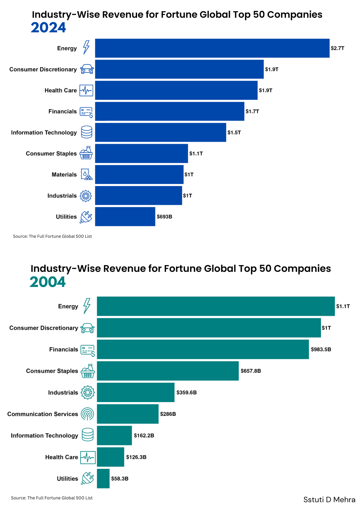
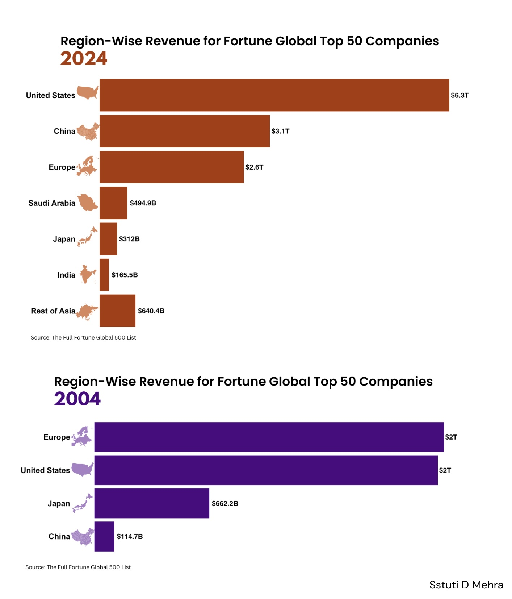
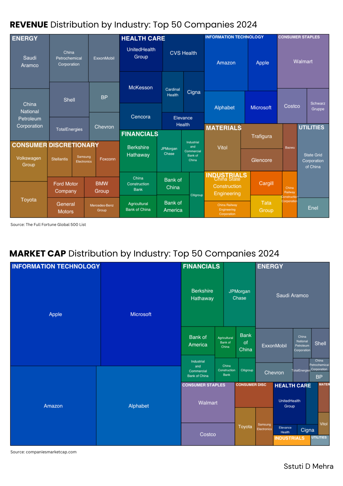

# 2024 Data Wrapped 📊

This project contains data analysis and visualization using data and statistics from the year 2024, hence the name "2024 Data Wrapped". The data has been collected by scraping online sources using Python's Beautiful Soup library, and the visualizations have been created using R.

I am also actively posting new graphs and analyses on [LinkedIn](https://www.linkedin.com/in/sstutidmehra/), so give me a follow! I would love to connect and discuss the visualizations!

## Graphs + Analyses

I will constantly be updating this section as I develop new visualizations.

### Industry Revenues

-   [Web Scraping Python Script](Industry_Revenues_Web_Scraping.ipynb)
-   [R Code for Visualizations](Industry_Revenues.qmd)

### 2024 vs 2004: Industry-Wise Revenue for the Fortune Top 50 Companies

Top 5 companies by revenue 2024: Walmart, Amazon, State Grid Corp. of China, Saudi Aramco, China Petrochemical Corp.\
Top 5 companies by revenue 2004: Walmart, BP p.l.c., ExxonMobil, Shell, General Motors\
\
Observations from the graph:\
• 𝗥𝗲𝘃𝗲𝗻𝘂𝗲 𝘃𝘀. 𝗠𝗮𝗿𝗸𝗲𝘁 𝗖𝗮𝗽𝗶𝘁𝗮𝗹𝗶𝘇𝗮𝘁𝗶𝗼𝗻: industry revenue rankings differ significantly from market capitalization standings (tech is the largest by market capital)\
• 𝗗𝗼𝗺𝗶𝗻𝗮𝗻𝗰𝗲 𝗼𝗳 𝘁𝗵𝗲 𝗘𝗻𝗲𝗿𝗴𝘆 𝗦𝗲𝗰𝘁𝗼𝗿: despite the tech industry's popularity, oil and gas companies have led revenue rankings for 20 years, even amid clean energy initiatives\
• 𝗚𝗿𝗼𝘄𝘁𝗵 𝗶𝗻 𝗛𝗲𝗮𝗹𝘁𝗵 𝗰𝗮𝗿𝗲 𝗦𝗲𝗰𝘁𝗼𝗿: the Health care sector has climbed 5 places since 2004, driven by higher spending, advancements in MedTech, and rising global demand\
• 𝗧𝗲𝗰𝗵 𝗦𝗲𝗰𝘁𝗼𝗿 𝗔𝗱𝘃𝗮𝗻𝗰𝗲𝗺𝗲𝗻𝘁𝘀: Fueled by the Fourth Industrial Revolution, the tech sector has also risen 2 places since 2004, led by Amazon and Apple\
• 𝗖𝗼𝗻𝘀𝗶𝘀𝘁𝗲𝗻𝘁 𝗟𝗲𝗮𝗱𝗲𝗿: Walmart retained its spot as the highest-revenue company in both 2004 and 2024

### 2024 vs 2004: Region-Wise Revenue for the Fortune Top 50 Companies

• 20 years ago, Europe and the US were nearly equal in revenue among the Top 50 companies in the Fortune list, with Japan at the third spot\
\
• In 2024, we see a global shift in economic power. US companies have surged ahead by a large margin, driven by technology and innovation\
\
• China now holds the second position, showing its exponential growth in the last two decades\
\
• The landscape has also expanded, with new players like India, Saudi Arabia, and other Asian countries, reflecting diverse global economic power

### Hierarchical Treemaps on Revenues vs Market Capitalization for the Fortune Top 50 Companies

Market capitalization (valuation) reflects the investors’ confidence in the growth potential, and investors put their money where they anticipate maximum growth\
\
Looking at the figures below:\
• While the Energy sector leads with the largest revenue, the Tech industry dominates market cap\
• Tech companies have huge valuations relative to their revenues, indicated by the large skew we see in the second treemap\
• Financial firms are balanced between their revenue generation and market cap
